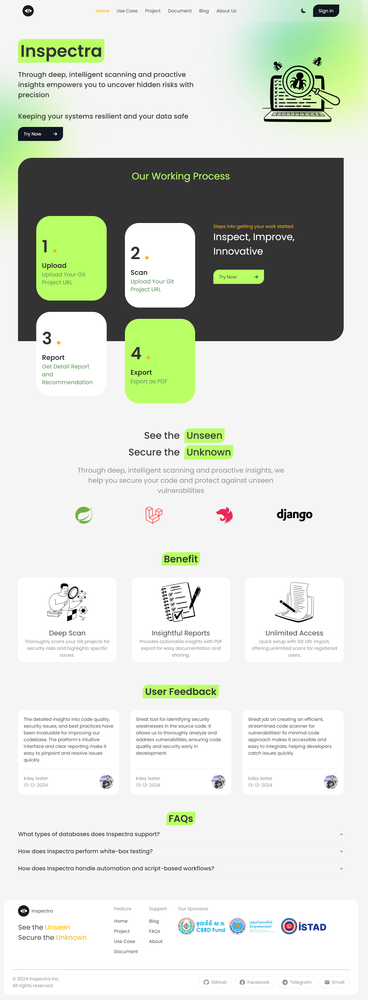

# Inspectra

<a name="readme-top"></a>

<br />
<div align="center">
  <a href="http://136.228.158.126:4012/">
    
  </a>
</div>

<br />

<!-- TABLE OF CONTENTS -->
<details>
  <summary><h3>🔮 Table of Contents</h3></summary>
  <ol>
    <li><a href="#about">📄 About Inspectra</a></li>
    <li>
      <a href="#getting-started">🚀 Getting Started</a>
      <ul>
        <li><a href="#local-installation">⚙️ Local Installation</a></li>
        <li><a href="#deployment">🚜 Deployment</a></li>
      </ul>
    </li>
    <li><a href="#features">🎡 Features</a></li>
    <li><a href="#dependencies">📓 Dependencies</a></li>
    <li><a href="#documentation">🔖 Documentation</a></li>
    <li><a href="#contributors">👥 Contributors</a></li>
    <li><a href="#page-url">🌐 Page URL</a></li>
  </ol>
</details>

<br />

<!-- ABOUT THE PROJECT -->

## About 🔗

<a href="http://136.228.158.126:4012/">
  
</a>

<br /><br />

Inspectra empowers you to uncover hidden risks with precision. Through deep, intelligent scanning and proactive insights, we help you secure your code and protect against unseen vulnerabilities—keeping your systems resilient and your data safe based on Sonar Architecture.

<p align="right">(<a href="#readme-top">back to top</a>)</p>

<br />

<!-- GETTING STARTED -->

## Getting Started 🚀

### ⚙️ Local Installation

1. Clone the repo
   ```sh
   git clone https://github.com/Inspectra-Cyber-Team/Inspectra-UI.git
   ```
2. Install Dependencies
   ```sh
   npm i or npm install
   ```
3. Run the project
   ```sh
   npm run dev
   ```

<p align="right">(<a href="#readme-top">back to top</a>)</p>

### 🚜 Deployment

Deployment URL: [http://136.228.158.126:4012/](http://136.228.158.126:4012)

<p align="right">(<a href="#readme-top">back to top</a>)</p>

<br />

<!-- FEATURES -->

## Features 🎡

- 🔄 Comprehensive Language and Framework Support
- ⚙️ Automated Code Analysis
- 🔝 Detailed Reporting
- 🏠 Integration-Friendly
- ⚖️ Security Standards Compliance following OWASP guidelines
- 🚀 Scalability

<p align="right">(<a href="#readme-top">back to top</a>)</p>

<br />

<!-- DEPENDENCIES -->

## Dependencies 📓

```json
"@hookform/resolvers": "^3.9.1",
"@radix-ui/react-accordion": "^1.2.1",
"@radix-ui/react-alert-dialog": "^1.1.2",
"@radix-ui/react-avatar": "^1.1.1",
"@radix-ui/react-checkbox": "^1.1.2",
"@radix-ui/react-dialog": "^1.1.2",
"@radix-ui/react-dropdown-menu": "^2.1.2",
"@radix-ui/react-label": "^2.1.0",
"@radix-ui/react-menubar": "^1.1.2",
"@radix-ui/react-scroll-area": "^1.2.1",
"@radix-ui/react-select": "^2.1.2",
"@radix-ui/react-separator": "^1.1.0",
"@radix-ui/react-slot": "^1.1.0",
"@radix-ui/react-tabs": "^1.1.1",
"@radix-ui/react-toast": "^1.2.2",
"@radix-ui/react-tooltip": "^1.1.4",
"@reduxjs/toolkit": "^2.3.0",
"@tailwindcss/typography": "^0.5.15",
"@tanstack/react-table": "^8.20.5",
"@tsparticles/react": "^3.0.0",
"@tsparticles/slim": "^3.7.1",
"class-variance-authority": "^0.7.0",
"clsx": "^2.1.1",
"cookie": "^1.0.2",
"date-fns": "^4.1.0",
"dompurify": "^3.2.3",
"formik": "^2.4.6",
"html2canvas": "^1.4.1",
"html2pdf.js": "^0.10.2",
"i": "^0.3.7",
"input-otp": "^1.4.1",
"lucide-react": "^0.468.0",
"next": "14.2.18",
"next-auth": "^5.0.0-beta.25",
"next-themes": "^0.4.3",
"prismjs": "^1.29.0",
"quill": "^2.0.3",
"react": "^18",
"react-dom": "^18",
"react-hook-form": "^7.53.2",
"react-icons": "^5.3.0",
"react-quill": "^2.0.0",
"react-redux": "^9.1.2",
"sharp": "^0.33.5",
"swiper": "^11.1.15",
"tailwind-merge": "^2.5.4",
"tailwind-scrollbar-hide": "^1.1.7",
"tailwindcss-animate": "^1.0.7",
"yup": "^1.4.0",
"zod": "^3.23.8"
```

<p align="right">(<a href="#readme-top">back to top</a>)</p>

<br />

<!-- DOCUMENTATION -->

## Documentation 🔖

For detailed usage and API documentation, visit [Inspectra Documentation](http://136.228.158.126:4012/document).

<p align="right">(<a href="#readme-top">back to top</a>)</p>

<br />

<!-- TROUBLESHOOTING -->

## Troubleshooting ⚠️

- If you encounter issues during installation, ensure that you have the correct versions of Node.js and npm installed.
- For deployment issues, check the deployment logs for any errors.

<p align="right">(<a href="#readme-top">back to top</a>)</p>

<br />

<!-- CONTRIBUTORS -->

## Contributors 👥

- [Inspectra Team]
  - (https://github.com/Hemechi)
  - (https://github.com/HomPheakakvotey)
  - (https://github.com/lyhou123)
  - (https://github.com/PheakdeyPhalphea)
  - (https://github.com/ingdavann)

<p align="right">(<a href="#readme-top">back to top</a>)</p>

<br />

<!-- PAGE URL -->

## Page URL 🌐

1. [Home](http://136.228.158.126:4012/)
2. [Sign in](http://136.228.158.126:4012/login)
3. [Sign up](http://136.228.158.126:4012/signup)
4. [About us](http://136.228.158.126:4012/aboutUs)
5. [Profile](http://136.228.158.126:4012/myProfile)
6. [Use Case](http://136.228.158.126:4012/useCase)
7. [Project](http://136.228.158.126:4012/project)
8. [Document](http://136.228.158.126:4012/document)
9. [Blog](http://136.228.158.126:4012/blog)
10. [FAQs](http://136.228.158.126:4012/faq)
11. [Blog History](http://136.228.158.126:4012/blogHistory)
12. [Scan History](http://136.228.158.126:4012/scanHistory)

<p align="right">(<a href="#readme-top">back to top</a>)</p>

